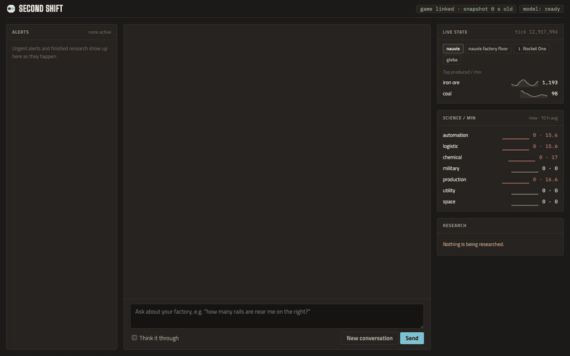
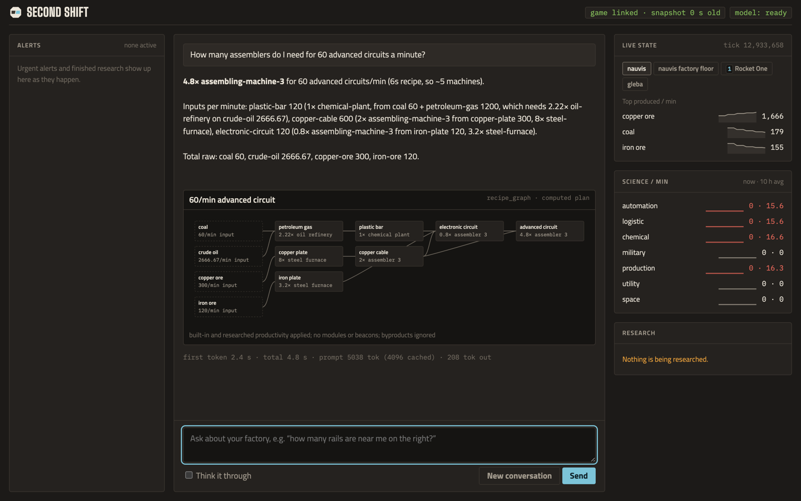
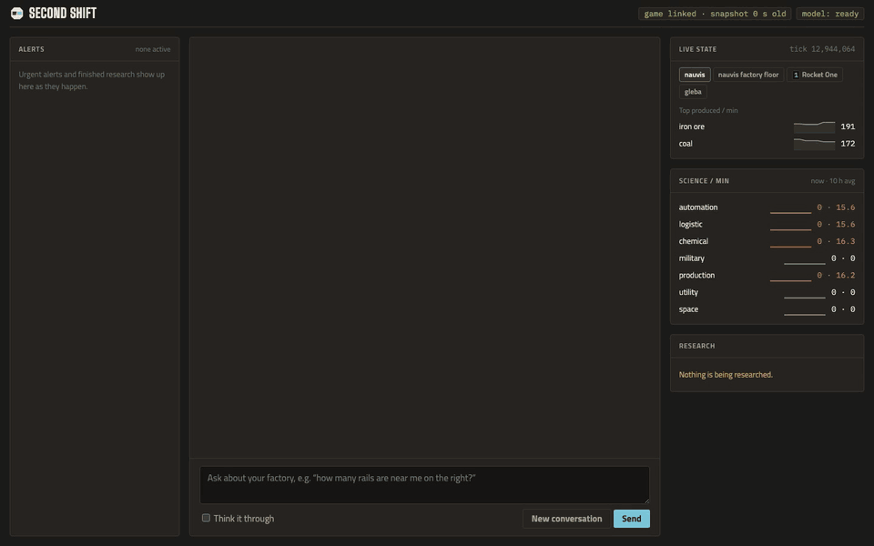
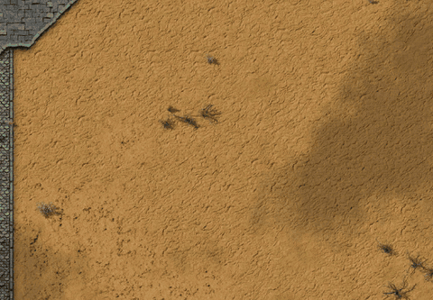
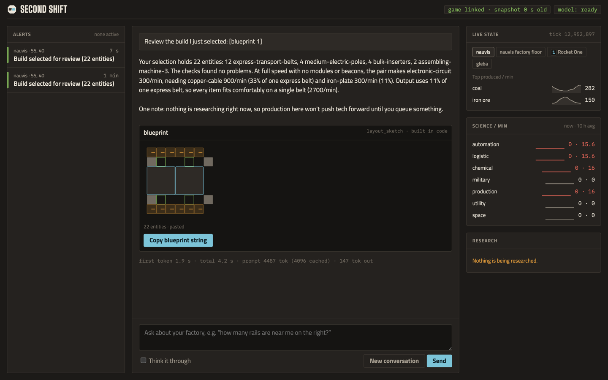
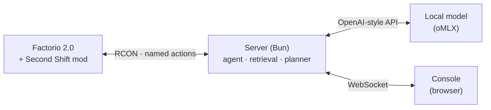

<p align="center">
  <picture>
    <source media="(prefers-color-scheme: dark)" srcset="brand/logo/lockup.svg">
    
  </picture>
</p>

<p align="center"><strong>A second engineer in your helmet.</strong></p>

<p align="center">A local AI companion for Factorio 2.0 that answers from your own save and can only do what you could.</p>

<p align="center"><a href="https://second-shift.wilytoad.com">second-shift.wilytoad.com</a></p>

<p align="center">
  
</p>

Second Shift runs next to your game, usually on a second monitor. You ask about your factory in plain words, and it
reads the answer from the running game and your save's own recipe data. When you ask it to change something, it
shows you exactly what will happen and waits for your OK. It never plays the game for you.

Everything runs on your machine: the game, a small mod, a local server and a local language model. Nothing is sent to
the cloud.

> **Status: early.** It works end to end on the author's macOS machine with a heavily modded Space Age save. It
> hasn't been tried on Windows or Linux yet, and it only talks to a local oMLX model for now. See [Requirements](#requirements) before you start.

## What it does

### Answers from your save, not from the wiki

Ask how much of something you make, what's holding production back, or how many machines a target needs. Recipes,
machine speeds and research come from a dump of your own save, so modded recipes are right. Charts are drawn from
the game's production statistics, never by the model.



### Blueprints on request, built by your robots

Ask for "a blueprint for 300 electronic circuits a minute" and it lays one out in code: machines, inserters, belts
and poles, sized to your research. Copy the string, or say "paste it here". Pasting is a map change, so you get a
card to confirm first. The ghosts go on your own undo history, and your construction robots do the building.

<p>
  
  
</p>

### Show it a build

Click the **Show the companion a build** shortcut in-game and drag over part of your factory. The console reviews
it: what's there, whether the belts and inserters keep up, and anything that looks wrong.



### Also

- **Finds things near you or where you're looking:** "how many express belts are near me?" It counts them and
  highlights them in-game.
- **Screenshots on request:** "take a screenshot of this spot."
- **Alerts and live state:** attacks, destroyed buildings, and finished research show up the moment they happen.
  Science rates and top products update every two seconds.
- **Small requests run straight away:** queue research, add a map tag, move the camera.
- **Map changes wait for you:** deconstruction and upgrade marks, blueprint pastes, recipe changes.

## The helmet rule

**If you can do it, the companion can. If you can't, it can't.** It uses the same tools, reach and map coverage you
have, at the same cost in time and items. The mod checks this every time an action runs. The companion never gets
raw Lua or console commands.

| Kind | Examples | What happens |
|---|---|---|
| Looking | Find, count, review a blueprint, screenshot | Runs straight away |
| Small requests you ask for | Queue research, add a map tag, move the camera | Runs straight away |
| Map changes | Paste ghosts, mark for deconstruction or upgrade, change a recipe | A card with the details; nothing changes until you confirm. Pastes and marks go on your Ctrl+Z history |
| Anything it suggests on its own | "Want me to mark these?" | Always a card |

So it can't place real buildings, delete things, teleport, spawn items, finish research or see through fog of war.

## Requirements

| | |
|---|---|
| **OS** | macOS on Apple Silicon. Paths assume the Steam install; Windows and Linux aren't supported yet |
| **Factorio** | 2.0 from Steam, with Steam running. Tested with Space Age and extra mods |
| **Bun** | 1.3 or newer ([bun.sh](https://bun.sh)) |
| **Model** | oMLX (a local MLX model server) on `127.0.0.1:8888` serving a model with tool calling. Tested with Qwen3.8 Flash-Next (4-bit), which needs about 70 GB of memory. Smaller models haven't been tested |

Other model providers (OpenAI-compatible servers, hosted APIs) are planned but not built yet.

## Setup

1. **Get the code.**

   ```sh
   git clone https://github.com/WilyToad/second-shift.git
   cd second-shift
   bun install
   ```

2. **Close Factorio,** then turn on local RCON and install the mod. Factorio rewrites its config when it exits, so
   these only stick while the game is closed.

   ```sh
   bun run setup-rcon   # lets the server talk to the game: adds a local RCON port and random password to config.ini
   bun run link-mod     # installs the mod: links mods/second-shift into Factorio's mods folder and enables it
   ```

   Second Shift isn't on the Factorio mod portal yet, so `link-mod` is how it gets installed. It adds a `second-shift`
   link in `~/Library/Application Support/factorio/mods/` that points at this repo, so a `git pull` updates the mod too
   (Factorio loads the new code the next time it starts). In-game it shows up under **Mods** like any other mod.
   Both commands back up the file they change in `data/backups/`.

3. **Start oMLX** with your model loaded. The server reads the API key from `~/.omlx/settings.json` (`auth.api_key`).
   If your model isn't named `Qwen3.8-Flash-Next-oQ4e-mtp`, set `COMPANION_MODEL`.

4. **Start a game, hosted.** The mod runs in any game once it's enabled, but the server can only reach a game that's
   hosted as multiplayer (that's where RCON runs). A normal single-player game won't connect.

   **A new game:** start Factorio from Steam, choose **Multiplayer → Host new game**, set up your map as usual, and
   keep it private: untick public and LAN visibility and set a password. It saves and autosaves like any hosted game.

   **A save you already have:** let the launcher host it privately and check that the mod answers:

   ```sh
   bun run launch -- "$HOME/Library/Application Support/factorio/saves/my-base.zip"
   ```

   (**Multiplayer → Host saved game** in the menu works too.)

   > **Back up your save first.** A hosted game autosaves (every 10 minutes, 5 slots) and may overwrite your
   > `_autosave` files. To try it without touching anything, copy the save into `data/saves/` and host the copy
   > with `--dev` (no autosaves): `bun run launch -- data/saves/my-base-copy.zip --dev`

5. **Start the server** and open the console.

   ```sh
   bun run start        # http://127.0.0.1:5170
   ```

   The first answer takes longer while the model warms up; after that, the first words usually arrive in 2–3
   seconds.

### First questions to try

- "How much iron plate am I making? Chart it."
- "How many assemblers do I need for 60 advanced circuits a minute?"
- "How many express belts are near me?"
- "Give me a blueprint for 120 gears a minute."
- "What should I research next?"

Tick **Think it through** for harder planning questions (slower, more careful). **New conversation** clears the
thread.

## How it works



- **The mod** keeps a registry of machines from build events, polls a small slice each tick and sends a compact
  digest. On a large Space Age base it adds **under 0.1 ms per tick** (0.043 ms in the latest benchmark). It never
  scans the whole map on a timer; the only heavy moment is a one-time scan when a save first loads with the mod, with a
  few ticks of about 7 ms.
- **The server** asks for only what a question needs: an area search, the recipe lines that matter, the latest
  digest. It keeps the model's prompt cache warm, so follow-up answers start in about two seconds.
- **Numbers are computed in code:** production plans, blueprint throughput, charts. The model explains them; it
  doesn't do the arithmetic.
- **Time-critical alerts** (attacks, destroyed buildings) are plain Lua in the mod and never wait on the model.

The full design, measurements and decisions are in [`PLAN.md`](PLAN.md).

## Troubleshooting

| Problem | Fix |
|---|---|
| `RCON isn't enabled in config.ini` | Close Factorio and run `bun run setup-rcon` again; the game overwrites the change if it was open |
| `RCON never opened` | The game is still loading, or `config.ini` was reverted: close the game and run `bun run setup-rcon` |
| `RCON is up but the mod didn't answer` | Close the game, run `bun run link-mod`, and check **Mods** in-game for Second Shift |
| Steam asks to "launch with custom arguments" | Make sure Steam is running; always start the game through `bun run launch` |
| `game: not connected` in the console | The game isn't hosted, or is still loading. A single-player game can't connect: use **Multiplayer → Host new game** or `bun run launch`. The server keeps retrying, so there's no need to restart it |
| `model: error` | Check that oMLX is running on port 8888, the model name matches `COMPANION_MODEL`, and `~/.omlx/settings.json` has an API key |
| The first answer is very slow | The model is loading or its cache is cold. Later answers are faster |

## Development

```sh
bun run check          # unit tests + typecheck + work-file validation (must pass before committing)
bun run board          # sprint progress
```

With a save copy hosted (`bun run launch -- --dev`) and the server running:

- `bun scripts/test-helmet.ts` proves each action fails when the player couldn't do it.
- `bun scripts/eval-grounding.ts` and `bun scripts/eval-ratios.ts` check answers against the save's data.
- `bun scripts/benchmark.ts` (game closed) measures the mod's cost per tick.
- `bun scripts/capture/scene.ts` re-records the clips in `docs/media/`.

| Folder | What's in it |
|---|---|
| `mods/second-shift/` | The Lua mod: digest, machine registry, named actions and their checks |
| `server/` | Agent loop, model client, retrieval, planner, blueprint builder |
| `interfaces/` | The contract between game and server (schemas for every action and message) |
| `displays/` | The console (Preact + signals, bundled by Bun) |
| `brand/` | [Brand and style guide](brand/BRAND.md), design tokens, fonts, logos |
| `work/` | Sprints and backlog |

## License

[MIT](LICENSE). The bundled fonts are under the SIL Open Font License (see `brand/fonts/`).

Factorio is a trademark of Wube Software. Second Shift is a fan project and isn't affiliated with or endorsed by
Wube Software.
