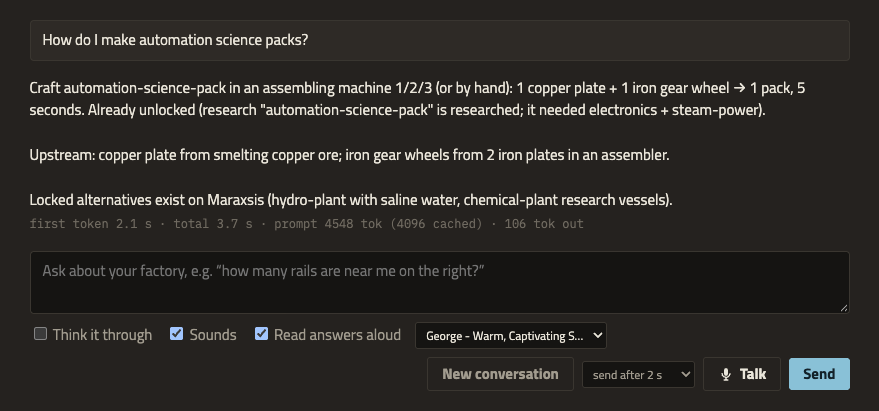
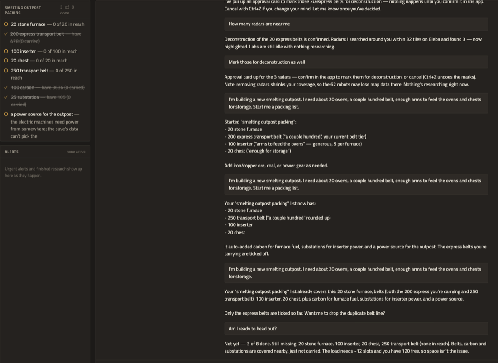
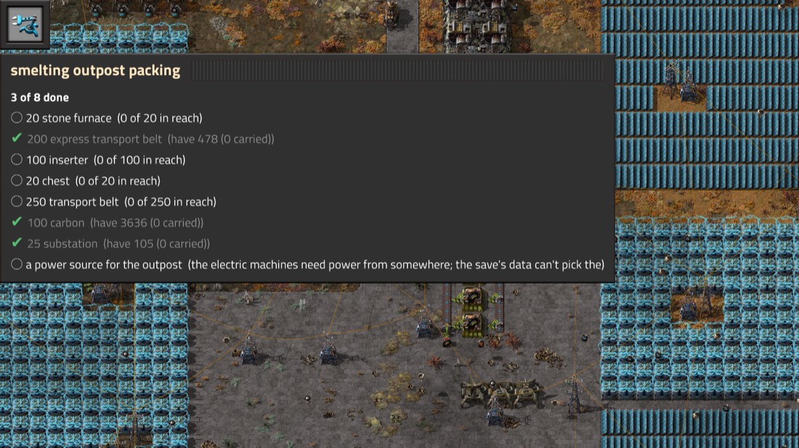
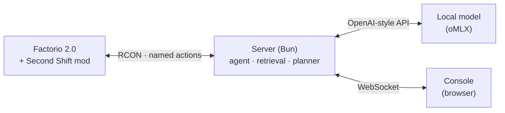

<p align="center">
  <picture>
    <source media="(prefers-color-scheme: dark)" srcset="brand/logo/lockup.svg">
    
  </picture>
</p>

<p align="center"><strong>A second engineer in your helmet.</strong></p>

<p align="center">A local AI companion for Factorio 2.0 that answers from your own game and can only do what you could.<br>
His name is Ballast. He used to fly a ship; now he counts your iron.</p>

<p align="center"><a href="https://second-shift.wilytoad.com">second-shift.wilytoad.com</a></p>

<p align="center">
  
</p>

Second Shift runs next to your game, usually on a second monitor. You ask about your factory in plain words, and it
reads the answer from the running game: its live state and its own recipe data. When you ask it to change something, it
shows you exactly what will happen and waits for your OK. It never plays the game for you.

There's a switch in the alerts panel called **Keep an eye on things**. With it on, Ballast looks at the factory every
few minutes while you play and writes at most one quiet line — idle labs, a production line that's fallen away — into
the feed. He never acts on what he finds, never speaks it aloud, and says nothing at all when the factory is fine,
which is most of the time. It's off until you turn it on.

Second Shift is the job. **Ballast** is who works it: the pilot AI off the ship that brought you here, now riding in
your helmet with no body and no ship, and rather good at manifests. You can call him by name — the speech recognizer
is told to expect it.

Everything runs on your machine: the game, a small mod, a local server and a local language model. With whisper.cpp
installed (`brew install whisper.cpp` and one model file), your voice is transcribed on your Mac too, and nothing
leaves it; without it, the browser's own speech service does the transcribing (see [Talk to it](#talk-to-it)).

> **Status: early.** It works end to end on the author's macOS machine with a heavily modded Space Age save. It
> hasn't been tried on Windows or Linux yet, and it only talks to a local oMLX model for now. See [Requirements](#requirements) before you start.

## What it does

### Answers from your game, not from the wiki

Ask how much of something you make, what's holding production back, or how many machines a target needs. Recipes,
machine speeds and research are read from the game you're playing, mods and all, so modded recipes are right. Charts are drawn from
the game's production statistics, never by the model.


### Blueprints on request, built by your robots

Ask for "a blueprint for 300 electronic circuits a minute" and it lays one out in code: machines, inserters, belts
and poles, sized to your research. Copy the string, or say "paste it here". Pasting is a map change, so you get a
card to confirm first. The ghosts go on your own undo history, and your construction robots do the building.

<p>
  
  
</p>

### Show it a build

Click the **Show the companion a build** shortcut in-game and drag over part of your factory. The console reviews
it: what's there, whether the belts and inserters keep up, and anything that looks wrong.


### Talk to it



Click **Talk** in the console, or press **Alt+V** there or in the game, and ask out loud. It stays on like a radio
channel: each pause (2 seconds by default, 1–5 s in the picker next to the button) sends what you said, the mic waits
while the answer arrives and is read aloud, then listens again. Click **Talk** again to stop (anything not yet sent
goes out first), or press **Escape** to stop without sending. The in-game key is **Talk to Second Shift** under
**Settings → Controls → Mods**.

Tick **Read answers aloud** to hear each answer sentence by sentence as it streams. Pick the voice next to it: this
Mac's own voice (download a Premium or Enhanced one in System Settings → Accessibility → Spoken Content for better
sound), or an [ElevenLabs](https://elevenlabs.io) voice if you add a key.

Short sound cues play when the mic opens, a question is sent, an alert or finished research arrives, and a card needs
you or is done. The **Sounds** switch turns them off.

Voice uses the browser's [Web Speech API](https://webaudio.github.io/web-speech-api/), so it needs Chrome (it doesn't
work in Brave). What stays on your machine:

| Part | Where it runs |
|---|---|
| Turning your voice into text | Chrome's online speech service by default. Click **Recognize on this device instead** under the composer for a one-time download, and after that it stays on your Mac |
| Reading answers aloud | On your Mac with a Mac voice. With an ElevenLabs voice, each answer's text goes to ElevenLabs |
| Sound effects | On your Mac |
| Everything else | On your Mac, as always |

**Adding ElevenLabs (optional).** Put your key in a `.env` file at the top of the repo; git ignores it:

```sh
ELEVENLABS_API_KEY=your-key
```

Restart `bun run start`. Your voices appear in the picker once **Read answers aloud** is on. The server holds the key
and uses ElevenLabs' fastest model; if a sentence fails, the Mac voice reads it. `bun run sounds` generates proper
sound effects with the same key into `data/sounds/` (they stay local, not in git); without them the console plays
simple built-in tones. `ELEVEN_LABS_KEY` works as the variable name too, `ELEVENLABS_VOICE_ID` sets a default voice
and `ELEVENLABS_MODEL` another model.

### Packing lists, so you don't arrive without the belts

<p>
  
  
</p>

Tell it what you're about to build, in your own words:

> I'm building a new smelting outpost. I need about 20 ovens, a couple hundred belt, enough arms to feed the ovens
> and chests for storage.

It writes a list with real counts, says the assumptions it made ("48 inserters: two an oven, rounded up"), and adds
what your game's own data says the build can't run without — fuel for a burner oven, poles and a power source for an
electric one, each with its reason next to it. Nothing else gets added: it doesn't guess at a repair pack you didn't
ask for.

The list then keeps itself current. As items land in your inventory or in a chest you can see, they tick themselves
off with a note ("have 24, none carried", "0 of 200 in reach"). Ask **"am I ready?"** before you walk out and you
get what's still missing, what you could hand-craft right now, and whether the load even fits — "the load needs
about 9 slots and you have 120 free".

Press **Alt+L** in the game for the same list on a panel, so you can check it away from the second monitor. The
panel is deliberately read-only: you show and hide it, and you change the list by asking. "Make it 30 ovens",
"drop the chests", "cross off the belts" — all of it goes through the companion, which is also what keeps the
console and the in-game panel saying the same thing.

If you're standing in your logistic network, **"can the bots bring the rest?"** puts the shortfall into your
requests behind a card. It goes in a section of its own called *Second Shift*, so your own requests are untouched;
saying **"stop requesting"** switches that section off and leaves it there for next time, and clearing the list
removes it. It never touches your *trash unrequested* setting — it only warns you when that setting would undo the
delivery.

Lists aren't only for packing: ask for one for repairs, or the things to check after a brownout. They're kept per
world, so they survive a reload.

### What you're pointing at

Hover something and ask **"what is this?"** It answers from your game: what the thing is, how much it holds, which
logistic job a chest does, how fast a belt runs, how far a pole reaches. If your mouse has moved on by the time you
finish talking, it uses what you last hovered and says how long ago. Ask **"what's in this chest?"** and it reads
the contents — of a wagon, a machine's input or a tank too.

It sticks to what your game's data says about a thing and tells you when the rest is base-game behaviour that a mod could
change, because in a heavily modded game the model's memory of vanilla is often wrong.

### Also

- **Finds things near you or where you're looking:** "how many express belts are near me?" It counts them and
  highlights them in-game, and the highlight disappears with whatever it marked.
- **Finds your stuff:** "where are my 200 steel?" It adds up what you carry and what's in the containers you can
  see, and tells you which one is nearest.
- **Measures a build instead of estimating it:** "what rate is this really hitting?" reads the machines' own craft
  counts twice and reports the real number, with the window it measured over.
- **Estimates as ranges, and names the limit:** a reviewed blueprint reads "about 287–600 a minute, held back by
  the inserters loading the assemblers", including when a machine has no inserter on one side at all.
- **Sends your spidertron:** "walk my spidertron over to me" puts up a card; on confirm it walks there with the
  game's own autopilot. **Alt+X**, saying "stop", driving it yourself or using your own remote all take it back at
  once.
- **Screenshots on request:** "take a screenshot of this spot."
- **Alerts and live state:** attacks, destroyed buildings, and finished research show up the moment they happen.
  Science rates and top products update every two seconds.
- **Small requests run straight away:** queue research, add a map tag, move the camera.
- **Map changes wait for you:** deconstruction and upgrade marks, blueprint pastes, recipe changes.

**In-game keys** (all rebindable under **Settings → Controls → Mods**):

| Key | What it does |
|---|---|
| **Alt+V** | Talk to Second Shift: starts and stops listening, in the game or in the console |
| **Alt+L** | Show or hide the list panel |
| **Alt+X** | Stop whatever the companion set moving |
| Shortcut bar | **Show the companion a build**: drag over part of your factory to have it reviewed |

## The helmet rule

**If you can do it, the companion can. If you can't, it can't.** It uses the same tools, reach and map coverage you
have, at the same cost in time and items. The mod checks this every time an action runs. The companion never gets
raw Lua or console commands.

| Kind | Examples | What happens |
|---|---|---|
| Looking | Find, count, review a blueprint, screenshot | Runs straight away |
| Small requests you ask for | Queue research, add a map tag, move the camera | Runs straight away |
| Map changes | Paste ghosts, mark for deconstruction or upgrade, change a recipe | A card with the details; nothing changes until you confirm. Pastes and marks go on your Ctrl+Z history |
| Anything it suggests on its own | "Want me to mark these?" | It asks first, in words; nothing happens unless you say yes (then map changes still get a card) |

So it can't place real buildings, delete things, teleport, spawn items, finish research or see through fog of war.

## Requirements

| | |
|---|---|
| **OS** | macOS on Apple Silicon. Paths assume the Steam install; Windows and Linux aren't supported yet |
| **Factorio** | 2.0 from Steam, with Steam running. Tested with Space Age and extra mods |
| **Bun** | 1.3 or newer ([bun.sh](https://bun.sh)) |
| **Browser** | Any modern browser for the console; Chrome for voice |
| **Model** | oMLX (a local MLX model server) on `127.0.0.1:8888` serving a model with tool calling. Tested with Qwen3.8 Flash-Next (4-bit), which needs about 70 GB of memory. Smaller models haven't been tested |

Other model providers (OpenAI-compatible servers, hosted APIs) are planned but not built yet.

## Setup

1. **Get the code.**

   ```sh
   git clone https://github.com/WilyToad/second-shift.git
   cd second-shift
   bun install
   ```

2. **Close Factorio,** then turn on local RCON and install the mod. Factorio rewrites its config when it exits, so
   these only stick while the game is closed.

   ```sh
   bun run setup-rcon   # lets the server talk to the game: adds a local RCON port and random password to config.ini
   bun run link-mod     # installs the mod: links mods/second-shift into Factorio's mods folder and enables it
   ```

   Second Shift isn't on the Factorio mod portal yet, so `link-mod` is how it gets installed. It adds a `second-shift`
   link in `~/Library/Application Support/factorio/mods/` that points at this repo, so a `git pull` updates the mod too
   (Factorio loads the new code the next time it starts). In-game it shows up under **Mods** like any other mod.
   Both commands back up the file they change in `data/backups/`.

3. **Start oMLX** with your model loaded. The server reads the API key from `~/.omlx/settings.json` (`auth.api_key`).
   If your model isn't named `Qwen3.8-Flash-Next-oQ4e-mtp`, set `COMPANION_MODEL`.

4. **Start a game, hosted.** The mod runs in any game once it's enabled, but the server can only reach a game that's
   hosted as multiplayer (that's where RCON runs). A normal single-player game won't connect.

   **A new game:** start Factorio from Steam, choose **Multiplayer → Host new game**, set up your map as usual, and
   keep it private: untick public and LAN visibility and set a password. It saves and autosaves like any hosted game.

   **A save you already have:** let the launcher host it privately and check that the mod answers:

   ```sh
   bun run launch -- "$HOME/Library/Application Support/factorio/saves/my-base.zip"
   ```

   (**Multiplayer → Host saved game** in the menu works too.)

   > **Back up your save first.** A hosted game autosaves (every 10 minutes, 5 slots) and may overwrite your
   > `_autosave` files. To try it without touching anything, copy the save into `data/saves/` and host the copy
   > with `--dev` (no autosaves): `bun run launch -- data/saves/my-base-copy.zip --dev`

5. **Start the server** and open the console.

   ```sh
   bun run start        # http://127.0.0.1:5170
   ```

   The first answer takes longer while the model warms up; after that, the first words usually arrive in 2–3
   seconds.

### First questions to try

- On a new map: "What should I do first?" or "What can I craft right now?"
- "How much iron plate am I making? Chart it."
- "How many assemblers do I need for 60 advanced circuits a minute?"
- "How many express belts are near me?"
- "Give me a blueprint for 120 gears a minute."
- "What should I research next?"
- Hover something and ask "what is this?", or "what's in this chest?"
- "I'm building a smelting outpost: 20 ovens, a couple hundred belt, arms to feed them and chests." Then **Alt+L**
  in the game, and "am I ready?" when you think you're packed.
- Click **Talk** and ask any of these out loud.

Tick **Think it through** for harder planning questions (slower, more careful). **New conversation** clears the
thread. Each map keeps its own conversation, so loading another save picks up where you left off on that one.

## How it works



- **The mod** keeps a registry of machines from build events, polls a small slice each tick and sends a compact
  digest. On a large Space Age base it adds **under 0.1 ms per tick** (0.043 ms in the latest benchmark). It never
  scans the whole map on a timer; the only heavy moment is a one-time scan when a save first loads with the mod, with a
  few ticks of about 7 ms.
- **The server** asks for only what a question needs: an area search, the recipe lines that matter, the latest
  digest. It keeps the model's prompt cache warm, so follow-up answers start in about two seconds.
- **Numbers are computed in code:** production plans, blueprint throughput, charts. The model explains them; it
  doesn't do the arithmetic.
- **Time-critical alerts** (attacks, destroyed buildings) are plain Lua in the mod and never wait on the model.

The full design, measurements and decisions are in [`PLAN.md`](PLAN.md).

## Troubleshooting

| Problem | Fix |
|---|---|
| `RCON isn't enabled in config.ini` | Close Factorio and run `bun run setup-rcon` again; the game overwrites the change if it was open |
| `RCON never opened` | The game is still loading, or `config.ini` was reverted: close the game and run `bun run setup-rcon` |
| `RCON is up but the mod didn't answer` | Close the game, run `bun run link-mod`, and check **Mods** in-game for Second Shift |
| Steam asks to "launch with custom arguments" | Make sure Steam is running; always start the game through `bun run launch` |
| `game: not connected` in the console | The game isn't hosted, or is still loading. A single-player game can't connect: use **Multiplayer → Host new game** or `bun run launch`. The server keeps retrying, so there's no need to restart it |
| `model: error` | Check that oMLX is running on port 8888, the model name matches `COMPANION_MODEL`, and `~/.omlx/settings.json` has an API key |
| Voice says the microphone is blocked | Allow the microphone for `127.0.0.1:5170` from the icon in Chrome's address bar |
| Voice says the speech service couldn't be reached | Use Chrome with a network connection, or click **Recognize on this device instead** once |
| Alt+V in the game doesn't start listening | Click **Talk** once in the console tab first so Chrome allows it; check the key under Controls → Mods |
| Alt+L shows no panel in the game | There's no list yet, or it's empty. Ask for one first: the panel hides itself when there's nothing on it |
| The bots don't bring what the list asked for | You have to be inside your own logistic network, and the network has to hold the items. The answer says which of the two it is |
| The first answer is very slow | The model is loading or its cache is cold. Later answers are faster |

## Development

```sh
bun run check          # unit tests + typecheck + work-file validation (must pass before committing)
bun run board          # sprint progress
```

With a save copy hosted (`bun run launch -- --dev`) and the server running:

- `bun scripts/test-helmet.ts` proves each action fails when the player couldn't do it.
- `bun scripts/eval-grounding.ts` and `bun scripts/eval-ratios.ts` check answers against the game's own data.
- `bun scripts/benchmark.ts` (game closed) measures the mod's cost per tick.
- `bun scripts/capture/scene.ts` re-records the clips in `docs/media/`.

| Folder | What's in it |
|---|---|
| `mods/second-shift/` | The Lua mod: digest, machine registry, named actions and their checks |
| `server/` | Agent loop, model client, retrieval, planner, blueprint builder |
| `interfaces/` | The contract between game and server (schemas for every action and message) |
| `displays/` | The console (Preact + signals, bundled by Bun) |
| `brand/` | [Brand and style guide](brand/BRAND.md), design tokens, fonts, logos |
| `work/` | Sprints and backlog |

## License

[MIT](LICENSE). The bundled fonts are under the SIL Open Font License (see `brand/fonts/`).

Factorio is a trademark of Wube Software. Second Shift is a fan project and isn't affiliated with or endorsed by
Wube Software.
